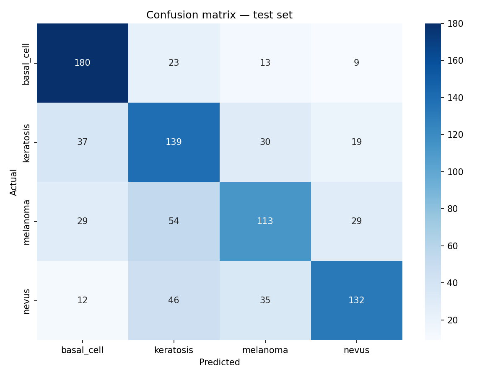
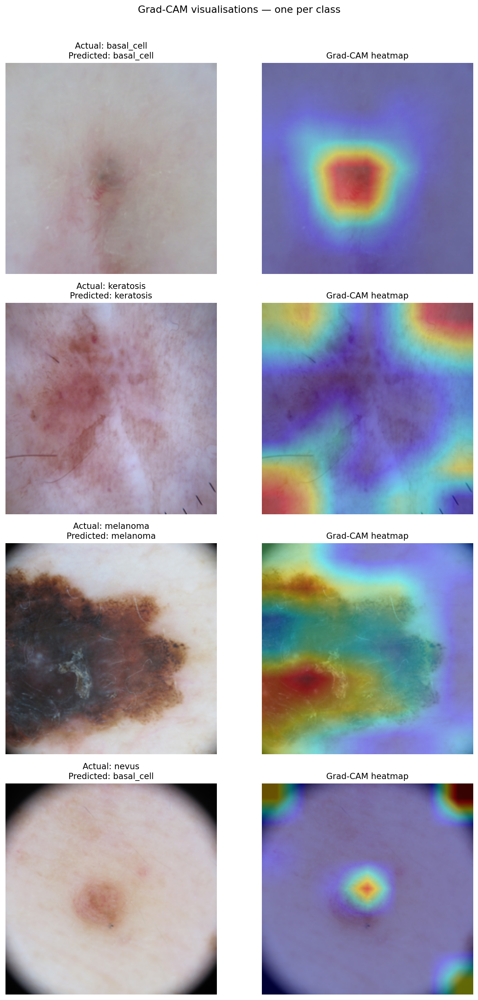

# Skin Condition Classifier — Backend API

A FastAPI backend serving a CNN-based skin lesion classifier with Grad-CAM interpretability visualisation. Built as a portfolio project for SIT ICT (Software Engineering) application.


## Live Demo
- **Full app:** https://skin-classifier-ui.vercel.app
- **Gradio demo:** https://huggingface.co/spaces/renomaaaa/skin-classifier
- **API docs:** https://renomaaaa-skin-classifier-api.hf.space/docs

## Results

| Class | Precision | Recall | F1 |
|-------|-----------|--------|----|
| Basal Cell Carcinoma | 0.70 | 0.80 | 0.75 |
| Benign Keratosis | 0.53 | 0.62 | 0.57 |
| Melanoma | 0.59 | 0.50 | 0.54 |
| Melanocytic Nevus | 0.70 | 0.59 | 0.64 |
| **Overall** | **0.63** | **0.63** | **0.62** |

Test accuracy: **62.7%** (vs 25% random baseline on 4-class problem)

## Confusion matrix


## Grad-CAM visualisations


## Technical decisions

**Transfer learning with EfficientNetB0** — The balanced ISIC dataset contains around 1,500 images per class, which is still relatively small for training a deep convolutional neural network from scratch. Doing so would likely lead to overfitting, where the model memorizes the training images instead of learning general patterns. To avoid this, I used EfficientNetB0 pretrained on ImageNet. Since it has already learned useful visual features such as edges, shapes, and textures, the model only needs to adapt these features to recognise different types of skin lesions.


**Two-phase training** — I trained the model in two stages.
Phase 1: I froze the pretrained EfficientNetB0 layers and trained only the final classification head using a learning rate of 1e-3. This allowed the new classifier to learn the skin lesion classes without changing the pretrained features.
Phase 2: After the classifier had stabilised, I unfroze the last 30 layers of EfficientNetB0 and fine-tuned them with a much smaller learning rate (1e-5). This helps the model adapt to dermoscopic images while reducing the risk of overwriting the useful features learned during pretraining.
Class Balancing

**Class balancing** — The original ISIC 2019 dataset is highly imbalanced. For example, the nevus class contains over 12,000 images, while classes like basal cell carcinoma have only around 3,000. To reduce this imbalance, I limited every class to 1,500 images. Although this meant using fewer total images, it encouraged the model to learn each class more evenly instead of favouring the majority class.

**Grad-CAM interpretability** — Medical AI models should not behave like "black boxes." To better understand what the model is looking at, I used Grad-CAM (Gradient-weighted Class Activation Mapping). Grad-CAM generates a heatmap showing which parts of the image contributed most to the prediction. For melanoma cases, the model often focuses on irregular borders and uneven pigmentation, which are also important visual cues used by dermatologists.


**Melanoma recall (0.50)** — One of the biggest challenges in this project is detecting melanoma. The model achieved a recall of 0.50, meaning it successfully identified about half of the melanoma cases in the test set. This is the weakest class in the model, but it is also the most important clinically because missing a melanoma (a false negative) can have serious consequences. One reason for this lower performance is that melanoma often shares visual characteristics with benign lesions such as keratosis, making them difficult to distinguish, especially with a relatively small training dataset.

## Dataset

ISIC 2019 Challenge dataset (publicly available). 4 classes, 1,500 images per class after balancing. 70/15/15 train/val/test split.

| Class | ISIC label | Raw count | After balancing |
|-------|-----------|-----------|-----------------|
| Melanoma | MEL | 4,522 | 1,500 |
| Melanocytic Nevus | NV | 12,875 | 1,500 |
| Basal Cell Carcinoma | BCC | 3,323 | 1,500 |
| Benign Keratosis | BKL | 2,624 | 1,500 |

## Tech stack
- Python 3.11
- TensorFlow / Keras (EfficientNetB0)
- FastAPI
- OpenCV (Grad-CAM overlay)
- Docker (Hugging Face deployment)
- pytest + GitHub Actions (CI pipeline)

## Testing & CI/CD

Automated test suite with pytest covering all main API endpoints. GitHub Actions runs the full test suite on every push to main.

### Test coverage
- `GET /` — root endpoint health check
- `POST /predict` — missing file returns 422
- `POST /predict` — wrong file type returns 400
- `POST /predict` — valid JPEG returns prediction, confidence scores, and Grad-CAM heatmap

### Running tests locally
```bash
pip install pytest httpx
pytest test_main.py -v
```

Tests use mocking to skip model loading — no GPU or model file needed to run the test suite.

## API

### POST /predict

Accepts a dermoscopy image, returns prediction and Grad-CAM heatmap.

**Request:** multipart/form-data with `file` field (JPEG/PNG/WebP, max 10MB)

**Response:**
```json
{
  "class": "melanoma",
  "confidence": 94.2,
  "all_scores": {
    "basal_cell": 1.1,
    "keratosis": 2.3,
    "melanoma": 94.2,
    "nevus": 2.4
  },
  "heatmap_base64": "/9j/4AAQ..."
}
```

## Run locally

```bash
git clone https://github.com/darelltan/skin-classifier-api
cd skin-classifier-api
python -m venv venv
venv\Scripts\activate
pip install -r requirements.txt
uvicorn main:app --reload
```

Place `final_model.keras` in the `models/` folder before running.

## Disclaimer

This is a research prototype built for a student portfolio. It is not a medical device and must not be used for clinical diagnosis. Always consult a qualified dermatologist.
